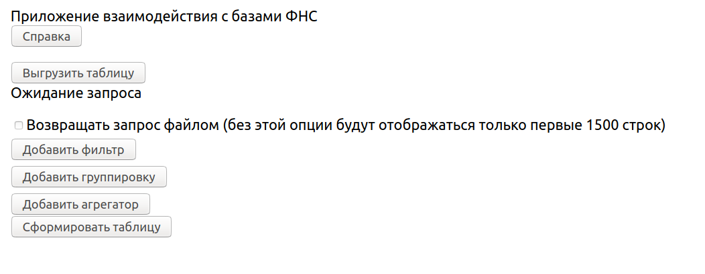

## MinEc

Web service for analytical purposes.
The aim is to load data from unstructured public Russian government's taxes databases. Service has the function of weekly updates and a web interface for statistics collections.

Simple and easy to use interafce and huge database (~150GB).

| UI example |
|:---:|
|  |

### Technology

Database: Postgres

Backend: Python, SQLAlhemy for communication with DB

Frontend: Javascript, Ract

Deployment: Nginx, Docker

